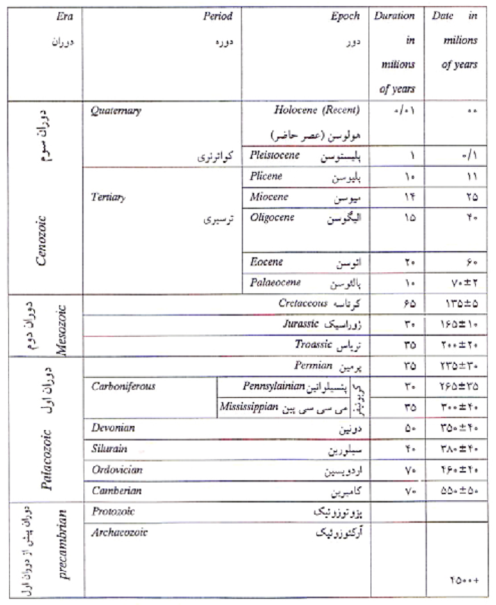

# 🪐 تعیین سن زمین با استفاده از سنگ‌های آسمانی

## چگونه سن زمین را تعیین کنیم؟
یکی از عواملی که می‌توان به واسطه آن سن زمین را تشخیص داد سنگ‌های آسمانی می‌باشد. از آنجا که مطابق تمام نظریات موجود تشکیل زمین و سایر سیارات منظومه شمسی همزمان بوده است با تعیین سن این سنگ‌ها می‌توان سن واقعی زمین را به دست آورد حداکثر سنی که تا به حال برای سنگ‌های آسمانی به دست آمده است ۴/۶ میلیارد سال می‌باشد. 🌠

### 📌 توضیح افزوده:  
سنگ‌های آسمانی (شهاب‌سنگ‌ها) که از زمان شکل‌گیری منظومه شمسی تاکنون تغییرات اندکی داشته‌اند، به‌عنوان «ساعت‌های کیهانی» عمل می‌کنند. با استفاده از روش‌های رادیومتریک مانند اورانیوم-سرب، دانشمندان توانسته‌اند سن برخی از این سنگ‌ها را تا حدود ۴٫۵۶ میلیارد سال تعیین کنند، که به‌عنوان سن تقریبی زمین نیز در نظر گرفته می‌شود.

---

## ⏳ تقسیم‌بندی زمان زمین‌شناسی

تقسیم بندی زمان زمین شناسی  
به طور کلی می‌توان تاریخ زمین را به دو بخش اساسی زیر تقسیم کرد.  
۱. **قبل از پیدایش حیات** که در آن حیات به وجود نیامده و نشانه‌ای از موجودات ذی حیات وجود ندارد. از آنجا که اطلاعات موجود راجع به این بخش ناچیز است هنوز تقسیم بندی بین المللی راجع به آن به عمل نیامده است.  
۲. **بعد از پیدایش حیات** که در آن نشانه‌های متعددی از وجود موجودات زنده مختلف در دست است این ائون را بر مبنای موجودات زنده و حرکات کوهزایی به چند دوران، هر دوران به چند دوره، هر دوره به چند دور و هر دور به چند آشکوب یا عصر تقسیم می‌شود. 🧬🌍

### 📌 توضیح افزوده:  
در زمین‌شناسی، این تقسیم‌بندی به دو ائون اصلی انجام می‌شود:  
- پروتروزوئیک و قبل‌تر (قبل از پیدایش حیات قابل مشاهده)  
- فانروزوئیک (بعد از پیدایش حیات قابل مشاهده)  

🔬 در ائون فانروزوئیک، تقسیم‌بندی دقیق‌تری وجود دارد که شامل دوران‌هایی مانند پالئوزوئیک، مزوزوئیک و سنوزوئیک است. هر یک از این دوران‌ها خود به دوره‌ها و سپس به دورها و آشکوب‌ها تقسیم می‌شوند، که بر اساس شواهد فسیلی و رویدادهای زمین‌ساختی مانند کوه‌زایی تعیین شده‌اند.🧪

---

## 🧭 جدول کامل تقسیم‌بندی زمین‌شناسی در ائون فانروزوئیک (از قدیم به جدید)

| 🌍 دوران        | ⏳ دوره           | 🕰️ دور             | 🧬 آشکوب (عصر)                     |
|--------------------|-----------------------|-------------------------|----------------------------------------|
| پالئوزوئیک     | کامبرین               | ترمونین، سریولین       | توموتین، بوتومین، آتدابان، فلورین     |
|                    | اردویسین              | لانویین، کارادوک       | آرنویلین، داپین، ساندبین، کتین        |
|                    | سیلورین               | لودلوین، پریدولین      | تلیچ، شنانتون، گورستون، لودلوین       |
|                    | دونین                 | گویتین، فراسنی         | زیوین، تاگن، فراسنی                   |
|                    | کربونیفر              | می‌سی‌سی‌پی، پنسیلوانی | تورن، ویسین، موزکوک، دس‌مونیس، ویرت   |
|                    | پرمین                 | سیسورالین، گوادالوپین  | آرتینسکین، کاپیتانین، ووردین، چانین   |
| مزوزوئیک       | تریاس                 | لادینین، نورین         | ایندون، آنیزین، لادینین، نورین، رتیان |
|                    | ژوراسیک               | آکسفوردین، کیمریجین    | هتانگین، سینمونین، باتونین، آکسفوردین |
|                    | کرتاسه                | سانتونین، کامپانین     | بارمین، آپتین، سانتونین، کامپانین     |
| سنوزوئیک       | پالئوژن               | پالئوسن، ائوسن         | دانین، سلندین، یپرسین، لوتتین، پریابون |
|                    | نئوژن                 | میوسن، پلیوسن          | آکیتانین، لانگین، مسینی، زانکلین      |
|                    | کواترنری             | پلیستوسن، هولوسن       | گلان، میدل، آپر، معاصر                 |

---

📌 توضیح افزوده:  
- این جدول بر اساس شواهد فسیلی (مانند ظهور یا انقراض گونه‌ها) و رویدادهای زمین‌ساختی (مانند کوه‌زایی‌ها و تغییرات اقلیمی) تنظیم شده است.  
- هر دوران نمایانگر تغییرات عمده در زیست‌کره و زمین‌ساخت است.  
- هر دوره شامل تغییرات جزئی‌تر در اقلیم و گونه‌های زیستی است.  
- دورها و آشکوب‌ها برای بررسی دقیق‌تر تحولات منطقه‌ای و زمانی به‌کار می‌روند.

