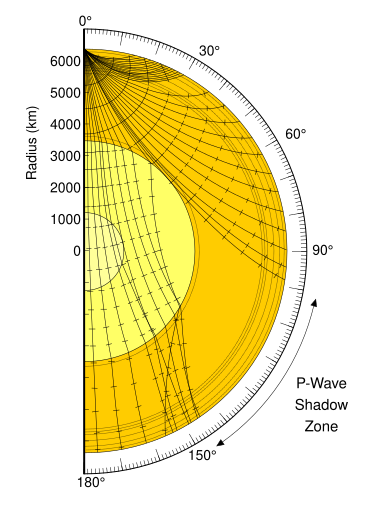
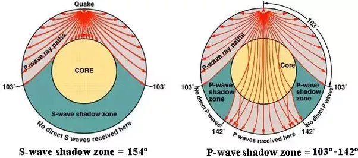

## 🌎 مطالعه درون زمین با استفاده از روش‌های ژئوفیزیکی

با استفاده از **روش‌های ژئوفیزیکی**، به‌ویژه بررسی **امواج لرزه‌ای**، می‌توان ویژگی‌های مواد درون زمین را از **پوسته** تا **هسته** مورد مطالعه قرار داد. این روش‌ها امکان می‌دهند تا بدون حفاری، اطلاعات ارزشمندی درباره‌ی ساختار و ترکیب لایه‌های درونی زمین به دست آید.

ویژگی‌های امواج لرزه‌ای در بخش‌های مختلف زمین شامل **پوسته، جبه و هسته** به‌صورت زیر است:

* * *

### 🪨 پوسته (Crust)

مطالعات امواج لرزه‌ای نشان می‌دهد که **پوسته زیر اقیانوس‌ها نازک‌تر** از پوسته زیر قاره‌ها است. همچنین امواج لرزه‌ای در پوسته اقیانوسی **با سرعت بیشتری** نسبت به پوسته قاره‌ای حرکت می‌کنند.  
این اختلاف سرعت بیانگر تفاوت در **نوع و ترکیب سنگ‌ها** در دو نوع پوسته است.

- **پوسته اقیانوسی:**  
    سرعت موج P در این پوسته حدود **۷ کیلومتر بر ثانیه** است و ضخامت آن بین **۵ تا ۸ کیلومتر** می‌باشد.  
    قسمت بالایی پوسته اقیانوسی از سنگ **بازالت** و قسمت زیرین آن از سنگ **گابرو** تشکیل شده است. 🪨
    
- **پوسته قاره‌ای:**  
    سرعت موج P در پوسته قاره‌ای حدود **۶ کیلومتر بر ثانیه** است.  
    بخش عمده‌ای از ترکیب پوسته قاره‌ای از سنگ **گرانیت** ساخته شده است.
    

ترکیبات پوسته قاره‌ای به دلیل داشتن سنگ‌های **روشن‌تر** و مقادیر بالای **فلدسپار و سیلیس**، ترکیبات **فلسیک (Felsic)** نامیده می‌شوند.  
در مقابل، ترکیبات پوسته اقیانوسی دارای سنگ‌های **تیره‌تر** با مقادیر بالای **منیزیم و آهن** هستند که **مافیک (Mafic)** خوانده می‌شوند. 🌑

ضخامت پوسته قاره‌ای بیشتر از پوسته اقیانوسی بوده و حدود **۳۰ تا ۷۰ کیلومتر** برآورد می‌شود.  
مرز میان پوسته بالایی (گرانیتی) و پوسته زیرین (بازالتی) را **ناپیوستگی کونراد (Conrad)** می‌نامند.  
همچنین مرزی که **پوسته و جبه** را از هم جدا می‌کند، **ناپیوستگی موهو (Moho)** نام دارد.

* * *

### 🌋 جبه (Mantle)

**موج P** با سرعت حدود **۸ کیلومتر بر ثانیه** از بخش فوقانی جبه عبور می‌کند.  
ترکیب این قسمت از جبه از سنگ‌های **اولترامافیک (Ultramafic)** است که کانی‌های شاخص آن **الیوین (Olivine)** و **پیروکسن (Pyroxene)** می‌باشند.

به ترکیب پوسته و قسمت فوقانی جبه، **لیتوسفر (Lithosphere)** گفته می‌شود.  
ضخامت لیتوسفر حدود **۷۰ کیلومتر** در زیر اقیانوس‌ها و بین **۱۲۵ تا ۲۵۰ کیلومتر** در زیر قاره‌ها است. 🌍

داده‌های لرزه‌ای نشان می‌دهند که در جبه، **چندین لایه در اعماق بین ۴۰۰ تا ۶۷۰ کیلومتر** وجود دارد.  
در برخی از نواحی جبه، با افزایش عمق، **سرعت امواج افزایش می‌یابد**، اما این روند همیشگی نیست؛ زیرا در بعضی اعماق، به دلیل **تغییر ترکیب شیمیایی کانی‌ها** و **تغییر فاز بلوری**، سرعت امواج کاهش پیدا می‌کند.

🔸 **مرزهای مهم جبه:**

- مرز بین جبه بالایی و جبه پایینی: **ناپیوستگی رِپِتی (Repetti)**
- مرز بین جبه و هسته بیرونی: **ناپیوستگی گوتنبرگ (Gutenberg)**

* * *

### 🧲 هسته (Core)

امواج لرزه‌ای شواهد روشنی از وجود **هسته زمین** ارائه می‌دهند.  
در جریان زمین‌لرزه‌های بزرگ، امواج لرزه‌ای در نواحی خاصی از سطح زمین **دریافت نمی‌شوند**.

- **موج P (طولی):**  
    امواج P در فاصله‌ی زاویه‌ای بین **۰ تا ۱۰۳ درجه** توسط ابزارهای لرزه‌سنج دریافت می‌شوند.  
    اما در محدوده‌ی بین **۱۰۳ تا ۱۴۲ درجه** هیچ موج P ثبت نمی‌گردد.  
    پس از زاویه‌ی **۱۴۲ درجه**، دوباره امواج P قابل شناسایی هستند.  
    این ناحیه‌ی بدون دریافت موج را **منطقه‌ی سایه‌ی موج P** می‌نامند، که علت آن **انکسار موج P در مرز هسته بیرونی** است.
    
- **موج S (برشی):**  
    از زاویه‌ی بیش از **۱۰۳ درجه** به بعد، امواج S ثبت نمی‌شوند.  
    منطقه‌ی سایه‌ی موج S گسترده‌تر از موج P است و نشان می‌دهد که امواج S نمی‌توانند از **هسته عبور کنند**.  
    بنابراین نتیجه می‌گیریم که **هسته بیرونی زمین مایع یا شبه‌مایع** است. 💧
    

ترکیب هسته زمین عمدتاً از **آهن و نیکل** تشکیل شده است.  
**هسته درونی** به دلیل فشار بسیار زیاد، در حالت **جامد** قرار دارد.  
مرز میان **هسته بیرونی** و **هسته درونی** را **ناپیوستگی لِه‌مَن (Lehmann)** می‌نامند.

⚙️ **رفتار امواج:**

- امواج **P** می‌توانند از مواد **جامد و مایع** عبور کنند.
- امواج **S** تنها از مواد **جامد** عبور می‌کنند.

⚖️ **چگالی لایه‌ها:**

- چگالی هسته زمین به‌طور میانگین حدود **۵٫۵ گرم بر سانتی‌متر مکعب** است.
- چگالی پوسته زمین حدود **۲٫۷ گرم بر سانتی‌متر مکعب** می‌باشد.
- چگالی سنگ‌های اولترامافیک در جبه حدود **۳٫۳ گرم بر سانتی‌متر مکعب** است.

* * *

📘 **جمع‌بندی**  
بررسی امواج لرزه‌ای ابزار قدرتمندی برای شناخت درون زمین است.  
با تحلیل سرعت و مسیر این امواج، می‌توان به ترکیب، چگالی و حالت فیزیکی لایه‌های مختلف زمین — از پوسته تا هسته — پی برد، بدون آنکه نیاز به حفاری در اعماق زیاد باشد. 🌐

&nbsp;

&nbsp;

* * *

&nbsp;

### 🖼️ تصویر: سایه امواج P و S

این تصویر ساختار داخلی زمین را نشان می‌دهد و نواحی سایه‌دار مربوط به امواج P و S را مشخص می‌کند. در این تصویر، نواحی سایه‌دار به وضوح با رنگ‌های متفاوت نمایش داده شده‌اند:

- **سایه امواج S (S-Wave Shadow Zone):** این ناحیه در حدود ۱۰۳ درجه تا ۱۸۰ درجه از کانون زلزله قرار دارد و نشان‌دهنده مناطقی است که امواج S به دلیل عبور از هسته مایع زمین قادر به رسیدن به آنجا نیستند.
    
- **سایه امواج P (P-Wave Shadow Zone):** این ناحیه بین حدود ۱۰۳ درجه تا ۱۴۰ درجه از کانون زلزله قرار دارد و نشان‌دهنده مناطقی است که امواج P به دلیل انکسار در مرز هسته-گوشته قادر به رسیدن به آنجا نیستند.
    

* * *

### 📘 توضیح تکمیلی:

سایه امواج S و P به دانشمندان کمک کرد تا به وجود هسته مایع زمین پی ببرند. امواج S نمی‌توانند از مایعات عبور کنند، بنابراین عدم دریافت این امواج در نواحی خاص نشان‌دهنده وجود هسته مایع است. همچنین، انکسار امواج P در مرز هسته-گوشته نیز اطلاعاتی درباره ساختار داخلی زمین فراهم می‌کند.

&nbsp;

&nbsp;

&nbsp;