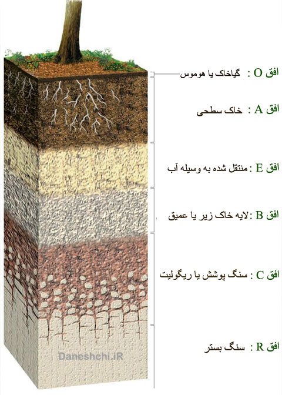

## 🪞 نیم‌رخ خاک (Soil Profile)

خاک از چندین **لایه‌ی مجزا** تشکیل شده است که به هر کدام **افق خاک (Soil Horizon)** گفته می‌شود.  
این لایه‌ها، ویژگی‌ها و عملکردهای متفاوتی دارند و به ترتیب از سطح زمین تا سنگ مادر قرار می‌گیرند. 🌍

* * *

### 🌿 افق O (Organic Horizon)

- بالاترین لایه‌ی خاک است.
- شامل **مواد آلی** مانند بقایای گیاهان و جانوران می‌باشد.
- **هوموس (Humus)** یا گیاه خاک در این افق قرار دارد و منبع تغذیه‌ی اولیه گیاهان به شمار می‌رود.

* * *

### 🟤 افق A (Topsoil / سطحی خاک)

- در زیر افق O قرار دارد.
- ترکیبی از **هوموس، ماسه، سیلت و رس** است.
- به همراه افق O، **افق بالایی (Topsoil)** را تشکیل می‌دهد.
- این افق معمولاً غنی از مواد غذایی گیاهان است اما به دلیل **حرکت رو به پایین یون‌ها و رس‌ها**، بخشی از مواد آلی و رس آن به افق‌های زیرین منتقل می‌شوند.
- به همین دلیل، افق A گاهی به نام **افق آب‌شسته (Leached Horizon / E Horizon)** نیز خوانده می‌شود. 💧

* * *

### 🟠 افق B (Subsoil / افق زیرین)

- در زیر افق A قرار دارد و حالت **انتقالی بین افق بالایی و سنگ مادر هوازده** را دارد.
- در این افق، ریشه‌های گیاهان نفوذ می‌کنند، اما **مواد آلی کمتر** است.
- **یون‌ها و رس‌های شسته شده** از افق بالایی در این لایه تجمع می‌یابند، به همین دلیل به آن **افق تجمع (Accumulation Horizon / B Horizon)** گفته می‌شود.
- به دلیل محتوای بالای رس، این لایه نسبتاً مرطوب باقی می‌ماند و نقش مهمی در **نگهداری آب** دارد. 💧

* * *

### ⚪ افق C (Parent Rock / سنگ مادر)

- پایین‌ترین لایه‌ی خاک است و شامل **سنگ‌های اصلی هوازده** می‌باشد.
- این افق بیشتر از مواد معدنی اولیه تشکیل شده و هنوز اثر قابل توجه هوازدگی شیمیایی و مکانیکی بر روی آن دیده می‌شود.

* * *

### 💧 حرکت آب و مواد محلول

- وقتی **باران یا آب سطحی** وارد خاک می‌شود، ابتدا از افق O و سپس افق A نفوذ می‌کند.
- در این مسیر، **کانی‌های هوازده و یون‌های محلول** به سمت پایین حرکت می‌کنند.
- این فرایند، **آب‌شستگی (Leaching)** نامیده می‌شود و باعث می‌شود افق A **کمتر از رس و بیشتر از ماسه** تشکیل شود.
- مواد محلول و رس شسته شده در افق B تجمع یافته و خاک این لایه را **مرطوب و غنی از رس** نگه می‌دارد.

* * *

📘 **جمع‌بندی:**  
نیم‌رخ خاک، نشان‌دهنده‌ی **توزیع لایه‌ها و مواد تشکیل‌دهنده‌ی خاک** است و نقش حیاتی در **حفظ آب، مواد غذایی و رشد گیاهان** دارد.  
شناخت این افق‌ها به **کشاورزی، مدیریت منابع آب و حفاظت خاک** کمک می‌کند. 🌱

