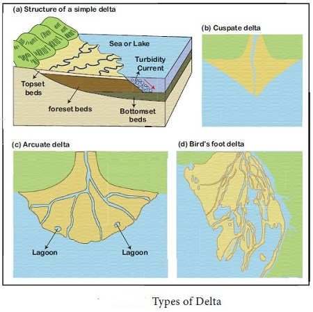

## 🏔️ دلتا و مخروط افکنه (Delta & Alluvial Fan)

### 🧭 تعریف کلی

هر دو **دلتا (Delta)** و **مخروط افکنه (Alluvial Fan)** حاصل از **رسوب‌گذاری رودخانه** هستند، اما تفاوت در **محیط رسوب‌گذاری** و **شدت کاهش سرعت جریان** دارند.

* * *

### 🪶 ۱. مخروط افکنه (Alluvial Fan)

#### ⚙️ فرایند تشکیل

- هنگامی که رود از **دامنه‌های پرشیب کوهستانی** به **دشت‌های مسطح** وارد می‌شود،  
    **گرادیان (Gradient)** و **سرعت جریان (Velocity)** به‌طور ناگهانی **کاهش می‌یابد**.
- در نتیجه رودخانه **توان حمل رسوبات درشت‌تر** را از دست می‌دهد و آنها را در ورودی دشت **ته‌نشین** می‌کند.
- این رسوبات شکلی **بادبزنی یا مخروطی (Fan-shaped)** به خود می‌گیرند.

#### 📍 ویژگی‌ها

- معمولاً در **مناطق خشک و نیمه‌خشک** تشکیل می‌شوند.
- ذرات رسوبی اغلب **درشت‌دانه** (قلوه‌سنگ و ماسه) هستند.
- آب در مسیرهای متعدد و موقتی (Distributaries) جریان دارد.

#### 🪨 اجزای اصلی

| بخش | ویژگی |
| --- | --- |
| رأس مخروط (Apex) | محل ورود رود از کوه به دشت |
| بدنه مخروط (Body) | ناحیه رسوب‌گذاری اصلی |
| حاشیه مخروط (Margin) | بخش‌های بیرونی با ذرات ریزتر |

* * *

### 🌊 ۲. دلتا (Delta)

#### ⚙️ فرایند تشکیل

- زمانی رخ می‌دهد که رودخانه وارد **آب‌های ساکن** مانند دریاچه‌ها یا اقیانوس‌ها 🌅 می‌شود.
- با **کاهش شدید سرعت جریان**، ذرات معلق و محلول **ته‌نشین** می‌گردند.
- رسوبات به‌تدریج سطحی **نسبتاً هموار** ایجاد می‌کنند به نام **دلتا**.

#### 📍 ویژگی‌ها

- بخشی از دلتا **زیر سطح آب** و بخشی دیگر **بالاتر از آن** قرار دارد.
- معمولاً دارای شبکه‌ای از **شاخه‌های توزیع‌کننده (Distributary Channels)** است.
- مواد رسوبی درشت‌تر در نزدیکی ساحل و ریزتر در نواحی عمیق‌تر ته‌نشین می‌شوند.

#### 🧱 لایه‌های ساختاری دلتا

1.  **Topset Beds:** رسوبات درشت در بالا و نزدیک ساحل.
2.  **Foreset Beds:** رسوبات مورب به سمت پایین آب.
3.  **Bottomset Beds:** رسوبات ریز در عمق آب.

* * *

### ⚖️ مقایسه دلتا و مخروط افکنه

| ویژگی | مخروط افکنه (Alluvial Fan) | دلتا (Delta) |
| --- | --- | --- |
| محل تشکیل | پای کوه، دشت‌های خشک | دریاچه یا دریا |
| نوع آب | جاری و موقتی | ساکن |
| نوع رسوب | درشت‌دانه | ریزدانه |
| شکل ظاهری | بادبزنی (Fan-shaped) | مثلثی (Delta-shaped) |
| محیط غالب | خشکی (Dry) | آبی (Aquatic) |

* * *

### 🧠 نکات کلیدی

- **Alluvial Fan:** حاصل کاهش ناگهانی شیب و سرعت در ورودی دشت‌ها.
- **Delta:** حاصل ورود رود به محیط‌های ساکن و ته‌نشینی تدریجی رسوبات.
- **هر دو ساختار** نشان‌دهنده کاهش انرژی جریان رود و آغاز رسوب‌گذاری هستند.

* * *

### 💡 جمع‌بندی

```text
کاهش سرعت → کاهش توان حمل → ته‌نشینی رسوبات
→ در خشکی: مخروط افکنه
→ در آب‌های ساکن: دلتا
```

> 🌍 نتیجه: دلتا و مخروط افکنه دو چهره‌ی متفاوت از رفتار یک رودخانه‌اند، بسته به این‌که در پایان مسیر خود به **دشت خشک** برسد یا به **آب ساکن**.

&nbsp;

