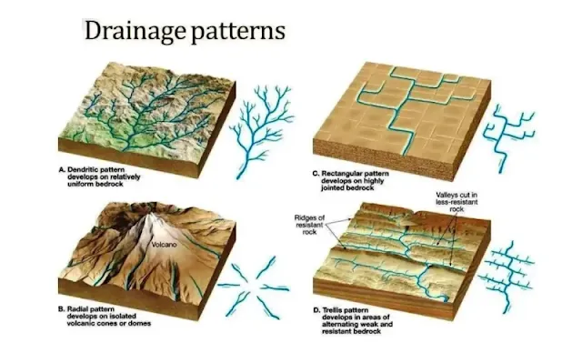
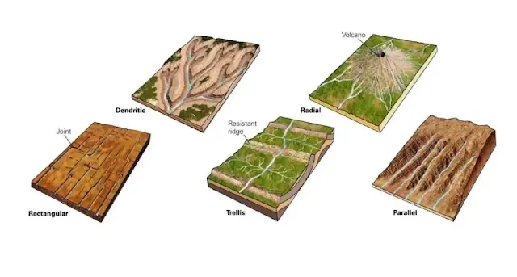
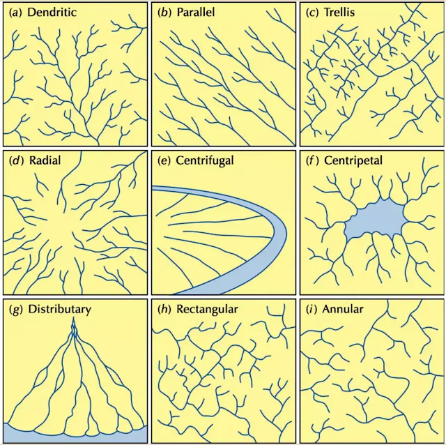
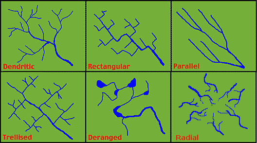

## 🌊 حوزه‌های آبریز (Drainage Basins)

### 🧭 تعریف

**حوزه آبریز (Drainage Basin)** منطقه‌ای است که توسط یک رود اصلی و **شاخه‌های فرعی (Tributaries)** آن زهکشی می‌شود.  
مرز بین دو حوزه آبریز مجاور معمولاً توسط **رشته‌کوه‌ها یا نواحی مرتفع** تعیین می‌شود و به آن **خط تقسیم آب (Drainage Divide)** گفته می‌شود.

* * *

### ⚙️ عملکرد

- تمام بارش‌ها (Rainfall) درون یک حوزه به سمت **رود اصلی** جریان پیدا می‌کنند.
- خروجی نهایی حوزه معمولاً به **دریا، دریاچه یا حوضه بسته داخلی** منتهی می‌شود.

* * *

## 🌀 الگوهای زهکشی (Drainage Patterns)

الگوی زهکشی، شکل و نحوهٔ اتصال شاخه‌های رودخانه در یک حوزه آبریز است. این الگوها معمولاً تابعی از **نوع سنگ بستر**، **ساختار زمین‌شناسی** و **شیب زمین** هستند.

* * *

### 🌿 1. الگوی شاخه‌درختی (Dendritic Drainage)

- **شکل:** مشابه رگ‌های برگ درخت 🍃
- **محیط تشکیل:** روی **سنگ بستر یکنواخت و هم‌جنس**
- **ویژگی:** رودها مسیر مستقیم به سمت پایین‌شیب را طی می‌کنند، بدون انحراف ساختاری.
- **اتصال شاخه‌ها:** به شکل **V** به رود اصلی وارد می‌شوند.

📍 **نمونه:** رودخانه‌هایی که روی سنگ‌های رسوبی نرم یا آذرین هم‌جنس جریان دارند.

* * *

### 🧱 2. الگوی داربستی (Trellis Drainage)

- **شکل:** مجموعه‌ای از رودهای **طویل، مستقیم و موازی** که توسط شاخه‌های فرعی قطع می‌شوند.
- **محیط تشکیل:** در نواحی دارای **لایه‌های سنگی متناوب سخت و نرم** (مثل ماسه‌سنگ و گرانیت).
- **علت:** رودها مسیر خود را از میان سنگ‌های نرم‌تر انتخاب می‌کنند.
- **ساختار مرتبط:** گسل‌خوردگی‌ها و چین‌خوردگی‌ها (faults & folds).

📍 **نمونه:** نواحی با لایه‌های رسوبی چین‌خورده یا دارای رخنمون‌های موازی.

* * *

### ⬜ 3. الگوی راست‌گوشه‌ای (Rectangular Drainage)

- **شکل:** شبکه‌ای با زوایای تقریباً ۹۰ درجه.
- **محیط تشکیل:** در مناطقی که سنگ بستر دارای **درزه‌ها یا گسل‌های متقاطع** است.
- **ویژگی:** شاخه‌های اصلی و فرعی تقریباً **طول مساوی** دارند و زاویه‌های قائمه تشکیل می‌دهند.

📍 **نمونه:** مناطق بلورین یا آذرین شکاف‌دار (Granite, Basalt).

* * *

### 🏔 4. الگوی شعاعی (Radial Drainage)

- **شکل:** رودها از **مرکز مرتفع (قله)** به سمت **پیرامون کوه** جریان می‌یابند ☀️.
- **محیط تشکیل:** در اطراف **کوه‌های آتشفشانی یا گنبدی**.
- **جهت جریان:** از بالا به پایین، به شکل شعاع‌های یک دایره.

📍 **نمونه:** کوه آتشفشان دماوند، مخروط‌های آتشفشانی و گنبدهای تکتونیکی.

* * *

### 🧠 نکات کلیدی

- **Drainage Basin:** محدوده‌ای که آب‌های سطحی درون آن به یک رود اصلی تخلیه می‌شوند.
- **Drainage Divide:** مرز طبیعی بین دو حوزه آبریز.
- **Dendritic:** روی سنگ‌های هم‌جنس و یکنواخت.
- **Trellis:** در نواحی چین‌خورده یا دارای لایه‌های متناوب سخت و نرم.
- **Rectangular:** تحت کنترل گسل‌ها و درزه‌ها.
- **Radial:** از مرکز مرتفع به اطراف جریان دارد.

* * *

### 💡 جمع‌بندی

```text
نوع سنگ + ساختار زمین = الگوی زهکشی
```

> 🌍 نتیجه: الگوی زهکشی هر منطقه، بازتابی از **ویژگی‌های زمین‌شناسی و توپوگرافی** آن است.







[Read More](https://www2.hawaii.edu/~dennis/GeoBook/chapter11/patterns.htm)

