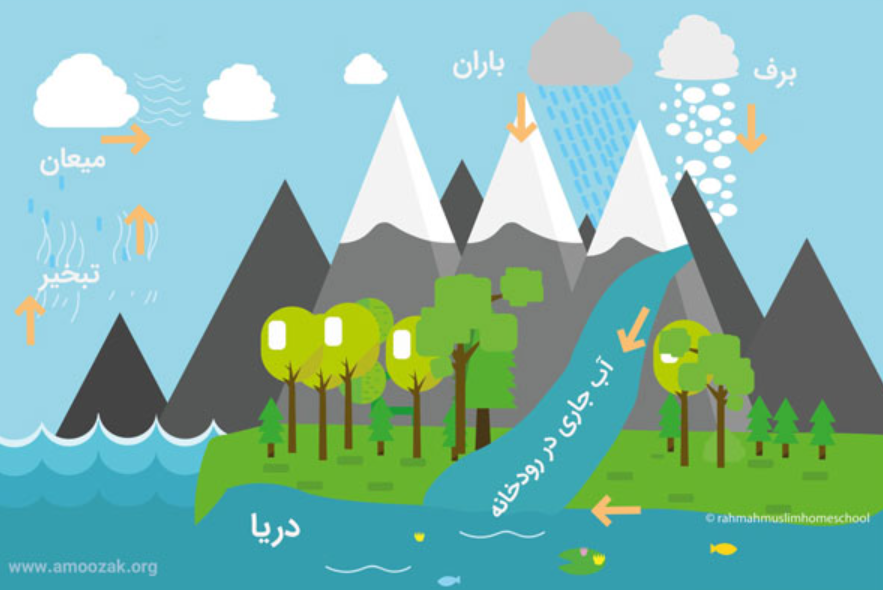
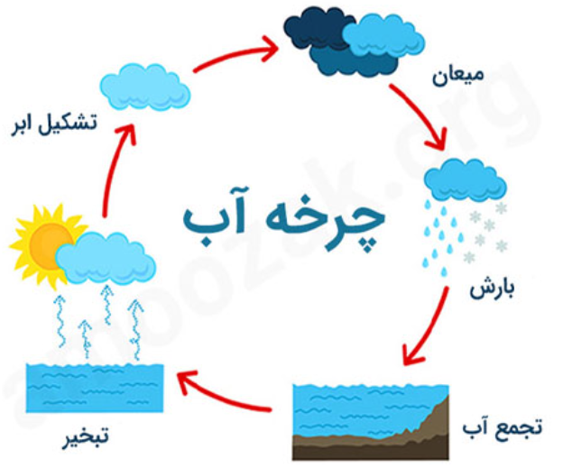

## 💧 چرخه آب (Water Cycle)

### 🌤 تعریف

چرخه آب، گردش پیوستهٔ آب بین سطح زمین و اتمسفر است. این فرایند شامل **تبخیر، تشکیل ابر، بارش و بازگشت آب به سطح زمین** می‌باشد.

* * *

### 🔆 مراحل اصلی چرخه

#### 1\. **تبخیر (Evaporation) و تعرق (Transpiration)**

- **تابش خورشید** باعث تبخیر آب از:
    
    - سطح دریاها و اقیانوس‌ها
    - آب باران و خاک
    - گیاهان (فرایند تعرق 🌿)
- نتیجه: تولید **بخار آب نامرئی** در اتمسفر.
    

#### 2\. **تراکم (Condensation)**

- بخار آب در جو سرد می‌شود و **تشکیل ابرها** می‌دهد ☁️.

#### 3\. **بارش (Precipitation)**

- ابرها پس از اشباع شدن، آب را به صورت **باران، برف یا تگرگ** 🌧️ به زمین بازمی‌گردانند.

* * *

### 🌊 سرنوشت آب پس از بارش

#### 1\. **آب سطحی (Surface Water)**

- در دریاها، رودخانه‌ها و نهرها جریان دارد.
- به آن **آب جاری یا روان‌آب (Runoff)** نیز گفته می‌شود.

#### 2\. **آب زیرزمینی (Groundwater)**

- بخشی از آب به **درون زمین نفوذ** کرده و مخازن زیرزمینی (آبخوان‌ها) را تشکیل می‌دهد.

#### 3\. **تبخیر مجدد**

- قسمتی از آب نفوذی دوباره **تبخیر شده و وارد اتمسفر** می‌شود 🔁.

* * *

### 🧠 نکات کلیدی

- **Transpiration** = تعرق گیاهان (تبدیل آب در گیاه به بخار).
- **Precipitation** = بارش (بازگشت آب به سطح زمین).
- **Runoff** = جریان آب سطحی.
- **Groundwater** = ذخیره زیرزمینی آب.

* * *

### ⚙️ عملکرد کلی

```text
Evaporation + Transpiration → Condensation → Precipitation → Runoff / Groundwater → Evaporation
```

> ♻️ این چرخه مداوم، مسئول توزیع مجدد آب در کره زمین است و تعادل اقلیمی و زیستی را حفظ می‌کند.

&nbsp;

 

