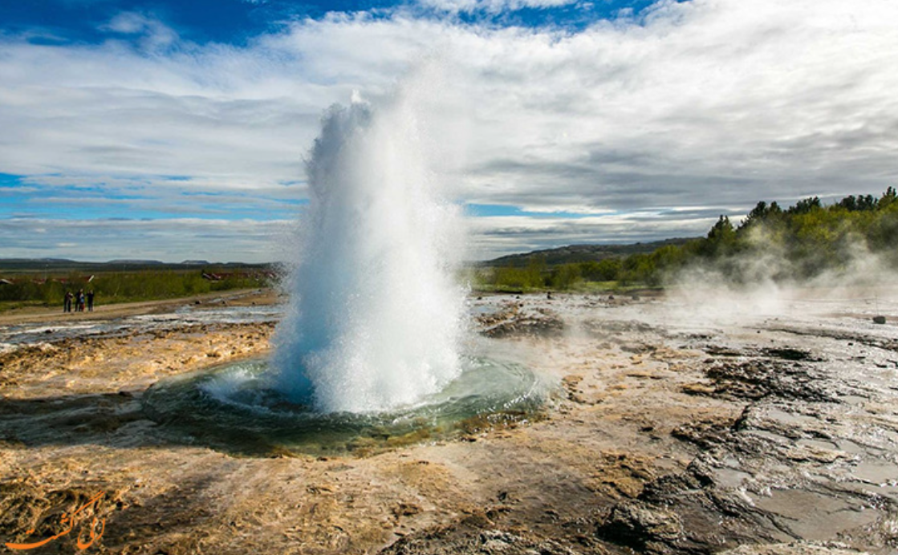

### 🌋 آبفشان‌ها و چشمه‌های آب گرم (Geysers & Hot Springs)

**تعریف:**  
در نقاط مختلف دنیا، **آب داغ طبیعی** از زمین خارج می‌شود و **چشمه‌های آب گرم** یا **آبفشان‌ها (Geysers)** را تشکیل می‌دهد. این پدیده‌ها ناشی از **گرم شدن آب زیرزمینی** و جریان آن به سطح زمین هستند.

* * *

### 🔥 گرم شدن آب زیرزمینی

آب زیرزمینی به سه روش اصلی گرم می‌شود:

1.  **گرمای زمین (Geothermal Gradient):**
    
    - دما به ازای هر کیلومتر حدود **۳۰°C افزایش می‌یابد**.
    - اگر آب از طریق شکستگی‌ها به عمق **۲–۳ کیلومتر** نفوذ کند، می‌تواند **۶۰–۹۰°C گرم شود**.
    - آب گرم چگالی کمتری دارد و به سمت بالا حرکت می‌کند.
    - این نوع چشمه‌ها به دلیل نیاز به **شکستگی‌های عمیق نادر**، معمولاً کم‌تر رایج هستند.
2.  **فعالیت‌های آتشفشانی گذشته:**
    
    - در مناطقی که قبلاً آتشفشانی بوده‌اند، **ماگما نزدیک سطح** باقی مانده و آب زیرزمینی را در اعماق کم گرم می‌کند.
    - این روش باعث تشکیل **چشمه‌های آب گرم رایج‌تر** می‌شود.
3.  **واکنش‌های شیمیایی گرمازا:**
    
    - آب گرم برخی چشمه‌ها دارای **بوی تخم‌مرغ فاسد** است (H₂S حل شده).
    - واکنش‌های شیمیایی با کانی‌های سولفیدی مانند **پیریت (FeS₂)** باعث تولید **H₂S و حرارت** می‌شوند.
    - این فرآیند به **گرم شدن آب زیرزمینی و بوی تند** منجر می‌شود.

* * *

### 💨 آبفشان‌ها (Geysers)

**تعریف:**  
آبفشان‌ها فوران‌های شدید **آب داغ و بخار** هستند که معمولاً بر روی **شکستگی‌ها و کانال‌های باز در سنگ‌های داغ زیرین** شکل می‌گیرند.

**فرآیند تشکیل فوران:**

1.  آب زیرزمینی به **درون شکستگی‌ها نفوذ** می‌کند و توسط سنگ‌ها گرم می‌شود.
2.  بخار تشکیل شده و به آرامی شروع به **بالا رفتن** می‌کند.
3.  اگر کانال باریک شود، **بخار به مانع برخورد** می‌کند و فشار از پایین افزایش می‌یابد.
4.  فشار زیاد باعث **فوران شدید آب گرم و بخار** به سطح زمین می‌شود، مشابه **بخار خروجی از کتری**.

* * *

### 🌿 نکات کلیدی

- چشمه‌های آب گرم و آبفشان‌ها **نشانه‌های گرمای داخلی زمین و جریان آب زیرزمینی** هستند.
- وجود **شکستگی‌ها، کانال‌ها و فشار بخار** برای فوران آبفشان ضروری است.
- بوی تند بعضی چشمه‌ها ناشی از **سولفید هیدروژن (H₂S)** و واکنش‌های شیمیایی کانی‌های سولفیدی است.

💡 **خلاصه تصویری:**  
آب زیرزمینی → نفوذ به شکستگی‌ها → گرم شدن → تشکیل بخار → افزایش فشار → **فوران آبفشان و چشمه‌های آب گرم** 🌋💨

&nbsp;

## مثال: پاموکاله | Pamukkale:

&nbsp;