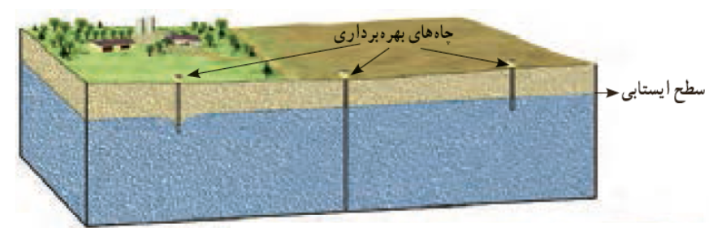
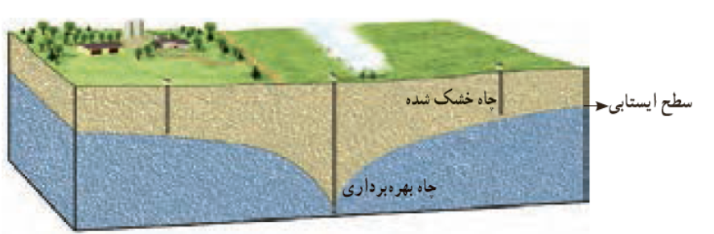
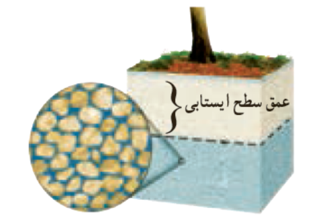

### 💧 سطح ایستابی (Water Table)

**تعریف کلی:**  
وقتی باران به زمین نفوذ می‌کند، بخشی از آن به عمق خاک و سنگ‌ها فرو می‌رود تا جایی که فضاهای خالی بین ذرات کاملاً از آب پر شوند. این ناحیه را **زون اشباع (Zone of Saturation)** می‌گویند.  
حد بالایی این ناحیه، یعنی جایی که خاک از حالت مرطوب به اشباع‌شده تغییر می‌کند، **سطح ایستابی (Water Table)** نام دارد.

* * *

### 🌍 ساختار عمقی آب زیرزمینی

#### 🟤 ۱. زون اشباع (Zone of Saturation)

- تمام منافذ و شکستگی‌های خاک و سنگ از آب پر شده‌اند.
- آب در این ناحیه همان **آب زیرزمینی واقعی** است.
- سطح بالایی این ناحیه همان **سطح ایستابی** است.

#### ⚪ ۲. زون غیر اشباع (Unsaturated Zone)

- در این لایه، خاک و سنگ **مرطوب** هستند ولی کاملاً **اشباع نشده‌اند**.
- بخشی از فضاهای خالی حاوی **هوا** و بخشی دیگر حاوی **آب** است.

#### 🌱 ۳. کمربند مرطوب خاک (Soil Moisture Belt)

- بخش بالایی خاک که مستقیماً با **ریشه گیاهان** در تماس است.
- در مناطق مرطوب، این افق معمولاً **رطوبت بالاتری** از زون غیر اشباع دارد.
- منبع اصلی **آب مورد نیاز گیاهان** محسوب می‌شود.

* * *

### ⚙️ فرآیندهای مؤثر در سطح ایستابی

- **گرانش (Gravity):** باعث حرکت آب به سمت پایین می‌شود.
    
- **مویینگی (Capillarity):** نیروهای الکتریکی مولکولی آب را از منافذ ریز به سمت بالا می‌کشند.
    
    - این فرآیند موجب می‌شود تا کمی بالاتر از سطح ایستابی نیز آب وجود داشته باشد.

* * *

### 💦 چشمه (Spring)

وقتی **سطح ایستابی بالاتر از سطح زمین** قرار گیرد، آب از زمین بیرون می‌زند و **چشمه** ایجاد می‌شود.

> 🌿 چشمه‌ها معمولاً در مناطق کوهستانی یا در امتداد شکستگی‌ها و لایه‌های نفوذپذیر دیده می‌شوند.

* * *

### 🧩 سطح ایستابی فرعی (Perched Water Table)

در برخی مناطق، میان لایه‌های نفوذناپذیر، **آب‌های زیرزمینی فرعی** به دام می‌افتند و سطح ایستابی **مجزایی** تشکیل می‌دهند که به آن **سطح ایستایی فرعی** گفته می‌شود.

> این پدیده معمولاً در مناطقی رخ می‌دهد که رس یا سنگ‌های غیرقابل نفوذ به‌صورت موضعی در میان لایه‌ها قرار گرفته باشند.

&nbsp;

### 💧 سطح ایستابی (Water Table)

**تعریف:**  
سطح ایستابی **سطح بالایی منطقه اشباع** است و مرز بین **ناحیه اشباع (Saturated Zone)** و **ناحیه بالایی غیر اشباع (Unsaturated Zone)** محسوب می‌شود.

* * *

### 🏞️ عمق چاه‌ها در مناطق مختلف

- **مناطق ساحلی:**
    
    - عمق سطح ایستابی کم است؛ معمولاً **چند متر** کافی است تا به آب زیرزمینی برسید.
- **مناطق خشک داخلی:**
    
    - عمق سطح ایستابی زیاد است؛ ممکن است **بیش از ۱۵۰ متر** حفاری لازم باشد تا به آب برسید.

* * *

### ⚙️ عوامل مؤثر بر عمق سطح ایستابی

1.  **جنس زمین:**
    
    - هرچه ذرات سازنده زمین **نفوذپذیرتر** باشند، آب راحت‌تر به عمق نفوذ می‌کند → سطح ایستابی **عمیق‌تر** خواهد بود.
2.  **میزان و شدت بارندگی:**
    
    - بارندگی بیشتر → نفوذ آب بیشتر → سطح ایستابی **بالاتر** می‌آید.
3.  **پوشش گیاهی:**
    
    - گیاهان با جذب آب و هدایت آن به خاک، باعث **بالا آمدن سطح ایستابی** می‌شوند.
4.  **شیب زمین:**
    
    - شیب زیاد → آب سریع‌تر به سمت پایین یا مسیرهای زهکشی می‌رود → سطح ایستابی **عمیق‌تر** تشکیل می‌شود.
5.  **میزان برداشت از چاه‌ها:**
    
    - برداشت بیش از حد آب → خشک شدن چاه‌ها → **کاهش سطح ایستابی** و افت آب زیرزمینی.

* * *

💡 **خلاصه:**  
عمق سطح ایستابی با **نوع خاک، بارندگی، پوشش گیاهی، شیب زمین و میزان برداشت آب** ارتباط مستقیم دارد.

- ساحل → سطح ایستابی کم و چاه‌های کم‌عمق 🌊
    
- مناطق خشک → سطح ایستابی عمیق و نیاز به چاه‌های بلند ⛰️
    

&nbsp;

&nbsp;