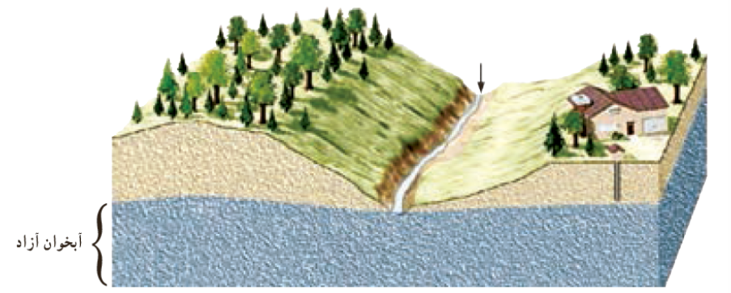
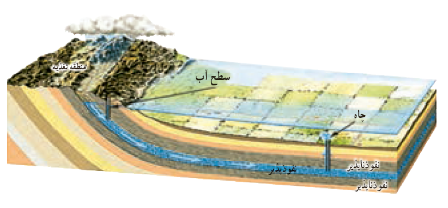
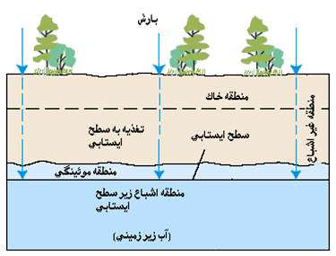

### 💧 آبخوان (Aquifer)

**تعریف:**  
آبخوان لایه‌ای از **سنگ یا رسوب آبدار** است که توانایی **ذخیره و انتقال آب زیرزمینی** را دارد.  
برای اینکه یک لایه به‌عنوان آبخوان شناخته شود، باید دو ویژگی اصلی را دارا باشد:

1.  **تخلخل (Porosity):** فضای خالی کافی برای ذخیره آب 🧱
2.  **نفوذپذیری (Permeability):** قابلیت عبور و جریان یافتن آب درون منافذ 💧

* * *

### 🪨 انواع سنگ‌ها و کیفیت آبخوان‌ها

| نوع سنگ یا رسوب | ویژگی‌ها | کیفیت آبخوان |
| --- | --- | --- |
| ماسه، شن، ماسه‌سنگ | تخلخل و نفوذپذیری بالا | ✅ بسیار خوب |
| سنگ آهک (به‌ویژه کارستی) | در صورت وجود شکاف و حفره زیاد | ✅ عالی |
| سنگ‌های کف شکسته‌شده (Fractured bedrock) | در اثر شکستگی‌ها، عبور آب ممکن است | ⚙️ متوسط تا خوب |
| شیل و رس | تخلخل زیاد ولی نفوذپذیری بسیار کم | 🚫 ضعیف |
| سنگ‌های آذرین و دگرگونی بدون شکستگی | فاقد منافذ مؤثر برای جریان آب | 🚫 بسیار ضعیف |

* * *

### ⚙️ ویژگی عملکردی آبخوان‌ها

- آبخوان‌ها نقش **مخزن طبیعی آب زیرزمینی** را دارند.
- از طریق چاه‌ها، قنات‌ها و چشمه‌ها می‌توان به آب موجود در آن‌ها دسترسی یافت.
- هرچه **درجه تخلخل و نفوذپذیری بیشتر** باشد، ظرفیت و عملکرد آبخوان نیز **بهتر** است.

* * *

💡 **نکته:**  
در مناطق کارستی (مانند سنگ‌های آهکی)، **انحلال شیمیایی** باعث ایجاد **حفرات بزرگ و کانال‌های طبیعی** می‌شود که باعث افزایش قابل‌توجه جریان آب درون آبخوان می‌گردد.

&nbsp;

### 💧 انواع سفره‌های آب زیرزمینی (آبخوان‌ها)

سفره‌های آب زیرزمینی به دو نوع اصلی تقسیم می‌شوند:

1.  **سفره‌های آب زیرزمینی آزاد (Unconfined Aquifers)**
    
2.  **سفره‌های آب زیرزمینی تحت فشار (Confined / Artesian Aquifers)**
    

* * *

### 🌊 سفره‌های آب زیرزمینی آزاد (Unconfined Aquifers)

**تشکیل و ویژگی‌ها:**

- یک **لایه نفوذپذیر** (مثل ماسه و شن) روی یک **لایه نفوذناپذیر** (مثل رس یا شیل) قرار دارد.
    
- سطح بالای آب در این نوع سفره، **سطح ایستابی آزاد** است و تحت فشار خاصی نیست.
    
- این سفره‌ها عمدتاً در **دشت‌ها و دامنه کوه‌ها** تشکیل می‌شوند.
    

**بهره‌برداری:**

- آب موجود در این سفره‌ها از طریق **حفر چاه یا قنات** قابل استخراج است.

💡 **نکته:**

- عمق سفره‌های آزاد معمولاً کمتر از سفره‌های تحت فشار است و بازیابی آن‌ها نسبتاً سریع‌تر انجام می‌شود.

* * *

### ⚙️ سفره‌های آب زیرزمینی تحت فشار (Confined / Artesian Aquifers)

**تعریف:**

- در این نوع آبخوان، لایه نفوذپذیر میان دو **لایه نفوذناپذیر** محصور شده است.
    
- آب در این سفره‌ها تحت فشار قرار دارد و اگر چاه حفر شود، **آب بدون پمپ به بالا می‌آید** (چاه آرتزین).
    

💡 **خلاصه:**

- **آزاد:** روی لایه نفوذناپذیر، سطح ایستابی قابل تغییر، دشت‌ها و دامنه‌ها
    
- **تحت فشار:** میان دو لایه نفوذناپذیر، فشار هیدرواستاتیکی بالا، امکان چاه آرتزین 🌊
    

&nbsp;

