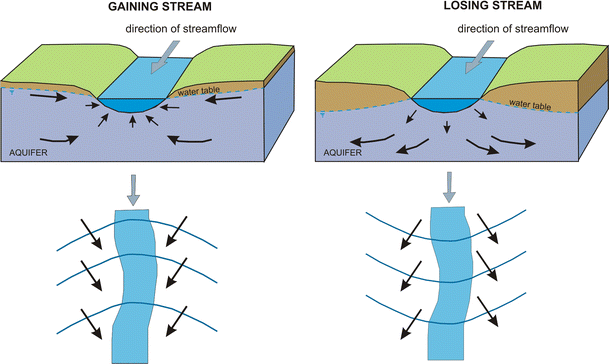
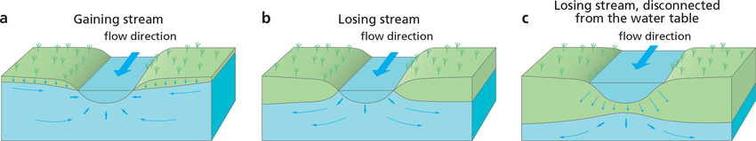

### 💦 حرکت آب‌های زیرزمینی (Groundwater Movement)

**تعریف کلی:**  
آب‌های زیرزمینی درون منافذ و شکستگی‌های سنگ و خاک به‌صورت **آرام و تدریجی** حرکت می‌کنند. این جریان معمولاً بسیار کندتر از جریان آب‌های سطحی است.

* * *

### 🌀 سرعت جریان آب زیرزمینی

- به‌طور میانگین، آب زیرزمینی حدود **۴ سانتی‌متر در روز** حرکت می‌کند.
    
- سرعت واقعی بستگی مستقیم به **نفوذپذیری (Permeability)** محیط دارد:
    
    - 🔹 در خاک‌ها و سنگ‌های **نفوذپذیرتر** → جریان سریع‌تر
    - 🔹 در مواد **کم‌نفوذ** مانند رس یا شیل → جریان بسیار کند

* * *

### 🧱 الگوی حرکت در آبخوان‌ها

- بیشتر آبخوان‌ها مانند **اسفنج‌های طبیعی** عمل می‌کنند؛ آب درون آن‌ها **به‌آرامی تراوش** می‌کند.
- در مناطق دارای **شکستگی‌های بزرگ یا غارها**، جریان آب می‌تواند بسیار سریع‌تر و حتی به‌صورت **رودخانه‌های زیرزمینی** باشد.

* * *

### 🧭 جهت جریان آب زیرزمینی

- آب زیرزمینی از مناطقی که **سطح ایستابی بالاتر** است به سمت نواحی با **سطح ایستابی پایین‌تر** حرکت می‌کند.
    
- به‌طور معمول:
    
    - سطح ایستابی زیر **تپه‌ها و ارتفاعات** بالاتر است.
    - سطح ایستابی در **دره‌ها و مناطق پست** پایین‌تر است.
    - بنابراین، جریان کلی آب زیرزمینی از **تپه‌ها → به سمت دره‌ها و رودخانه‌ها** است.

* * *

💡 **نکته:**  
این حرکت طبیعی باعث می‌شود **چشمه‌ها و رودخانه‌ها** در پایین‌دست و دره‌ها دائماً از آب زیرزمینی تغذیه شوند.

