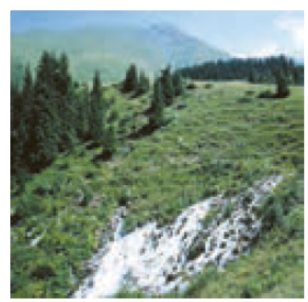

### 💧 چشمه‌ها (Springs)

**تعریف:**  
چشمه زمانی به وجود می‌آید که **سطح ایستابی (Water Table)** با **سطح زمین** برخورد کند. در این حالت، آبی که درون زمین جریان دارد، از طریق شکاف‌ها یا لایه‌های نفوذپذیر به سطح زمین می‌رسد و به‌صورت **جریان طبیعی آب** ظاهر می‌شود.

* * *

### 🧭 نحوه تشکیل چشمه‌ها

1.  **برخورد سطح ایستابی با سطح زمین:**  
    وقتی سطح ایستابی بالا بیاید و سطح زمین را قطع کند، آب زیرزمینی به‌طور طبیعی از زمین خارج می‌شود.  
    → این حالت معمولاً در **دره‌ها، دامنه کوه‌ها یا نواحی پست‌تر** رخ می‌دهد.
    
2.  **وجود لایه نفوذناپذیر محلی:**  
    در برخی مناطق، **لایه‌ای از سنگ یا رس نفوذناپذیر** در بالای سطح ایستابی اصلی وجود دارد.  
    این لایه موجب می‌شود که آب در بالای آن **به‌صورت محلی تجمع یافته** و یک **زون اشباع فرعی** تشکیل دهد.
    

* * *

### 🧩 سطح ایستابی معلق (Perched Water Table)

- این پدیده زمانی رخ می‌دهد که **آب در بالای یک لایه نفوذناپذیر محلی** جمع شود و سطح ایستابی کوچکی در ارتفاع بالاتر از سطح ایستابی اصلی شکل گیرد.
- چشمه‌هایی که در **دامنه یا قله تپه‌ها** دیده می‌شوند، معمولاً از همین **سطح ایستابی معلق** سرچشمه می‌گیرند.

* * *

### 🌿 جمع‌بندی

- چشمه = خروج طبیعی آب زیرزمینی در محل تقاطع سطح ایستابی و سطح زمین 💦
- چشمه‌های تپه‌ای = حاصل از **سطح ایستابی معلق** (Perched Water Table)
- چشمه‌ها نقش مهمی در **تغذیه رودخانه‌ها، تأمین آب آشامیدنی، و شکل‌گیری اکوسیستم‌های محلی** دارند 🌱

&nbsp;

