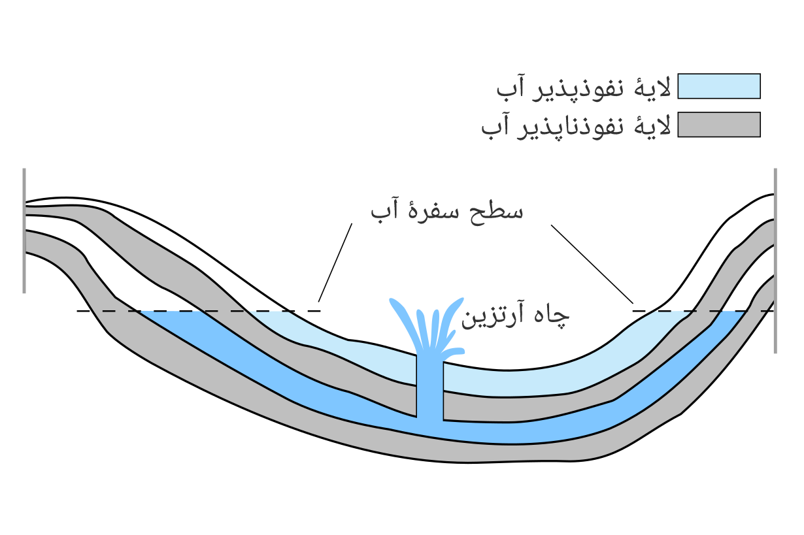
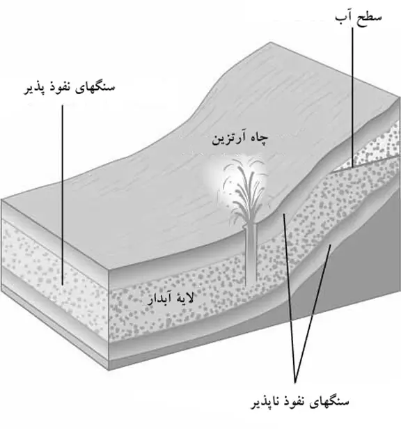

### 💦 چاه‌های آرتزین (Artesian Wells)

**تعریف:**  
چاه آرتزین نوعی **چاه فشار‌دار** است که درون یک **آبخوان شیبدار** حفاری می‌شود؛ این آبخوان میان دو لایه **نفوذناپذیر** (غیرقابل تراوش) قرار دارد و به آن **آبخوان آرتزین (Artesian Aquifer)** گفته می‌شود.

* * *

### 🧱 ساختار آبخوان آرتزین

- **لایه زیرین و بالایی** آبخوان از جنس سنگ یا رس **نفوذناپذیر** است.
- آب درون این لایه شیبدار از **منطقه تغذیه (Recharge Area)** در ارتفاعات وارد می‌شود.
- به دلیل وجود شیب و بسته بودن دو طرف، آب در پایین‌دست تحت **فشار هیدرواستاتیکی** قرار می‌گیرد.

* * *

### ⚙️ عملکرد چاه آرتزین

- هنگامی‌که چاه در این آبخوان حفر شود، آب به دلیل فشار درونی **بدون نیاز به پمپ** بالا می‌آید.
- اگر **فشار داخلی کافی** باشد، آب حتی می‌تواند **از سطح زمین خارج شود و فوران کند**.

* * *

### 💧 نکات مهم

- 🔹 **منطقه تغذیه:** محل ورود آب باران به آبخوان در ارتفاعات بالاتر.
- 🔹 **فشار هیدرواستاتیکی:** ناشی از وزن ستون آبی است که در بالادست قرار دارد.
- 🔹 **چاه آرتزین جاری (Flowing Artesian Well):** زمانی که فشار به‌قدری زیاد است که آب از سطح زمین بیرون می‌ریزد.

* * *

💡 **خلاصه تصویری ذهنی:**  
آبخوان آرتزین مانند یک **لوله‌ی شیبدار بسته از دو طرف** است؛ اگر در پایین آن سوراخی ایجاد کنید (چاه)، فشار باعث می‌شود آب **به‌طور طبیعی بالا بیاید یا حتی فوران کند (بنابراین نیازی به پمپاژ وجود ندارد)** 🚰

