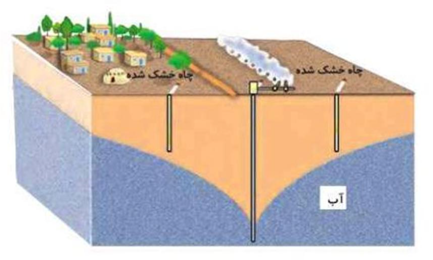
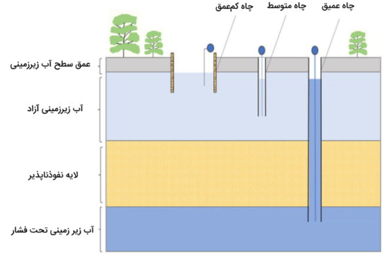

### ⚠️ تهی‌شدگی یا خالی شدن آب زیرزمینی (Groundwater Depletion)

**تعریف:**  
تهی‌شدگی زمانی رخ می‌دهد که **آب زیرزمینی سریع‌تر از میزان تغذیه آبخوان** برداشت شود. این پدیده باعث **افت سطح ایستابی (Water Table Decline)** و کاهش ظرفیت ذخیره آب در لایه‌های زیرزمینی می‌گردد.

* * *

### 💧 مخروط افت (Cone of Depression)

- وقتی آب از چاهی با سرعت زیاد **پمپ می‌شود**، سطح ایستابی در اطراف چاه پایین می‌افتد و شکلی **قیفی‌شکل** ایجاد می‌کند که به آن **مخروط افت (Depression Cone)** می‌گویند.
- هرچه سرعت پمپاژ بیشتر باشد، **شعاع مخروط افت** نیز بزرگ‌تر می‌شود.

* * *

### 🔁 بازیابی آبخوان (Recharge)

- در صورتی که آبخوان **نفوذپذیری مناسبی** داشته باشد، پس از توقف یا کاهش پمپاژ، آب می‌تواند طی **چند روز تا چند هفته** دوباره به چاه بازگردد.
- در غیر این صورت، روند بازگشت بسیار **کند** بوده و ممکن است **سال‌ها** طول بکشد.

* * *

### 🚱 پیامدهای پمپاژ بیش‌ازحد

1.  **افت دائمی سطح ایستابی** در اثر برداشت مداوم از چندین چاه در یک منطقه.
2.  **کاهش حجم آب قابل برداشت** و خشک شدن چاه‌ها.
3.  در مناطق ساحلی، احتمال **نفوذ آب شور دریا** به آبخوان‌های شیرین افزایش می‌یابد.
4.  **فرونشست زمین (Land Subsidence)** ممکن است در اثر فشرده شدن لایه‌های خشک‌شده رخ دهد.

* * *

### 🌍 جمع‌بندی

- 🔹 پمپاژ بیش از حد → تشکیل مخروط افت و افت سطح ایستابی
- 🔹 بازیابی ممکن است اما وابسته به نفوذپذیری و تغذیه طبیعی آبخوان است
- 🔹 تداوم برداشت بی‌رویه = خطر تخریب دائمی منابع آب زیرزمینی 🚨

